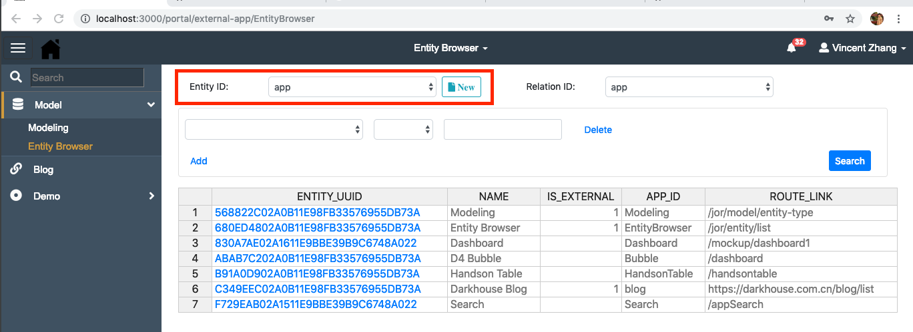
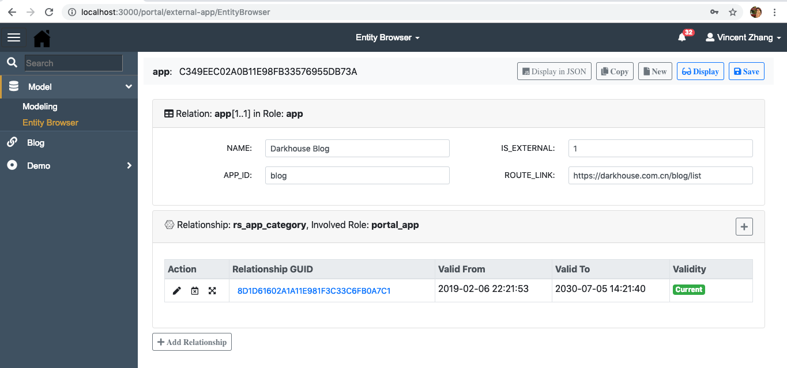
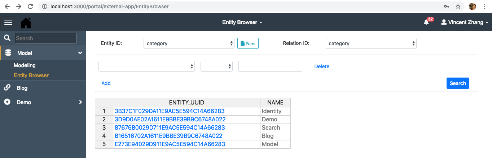
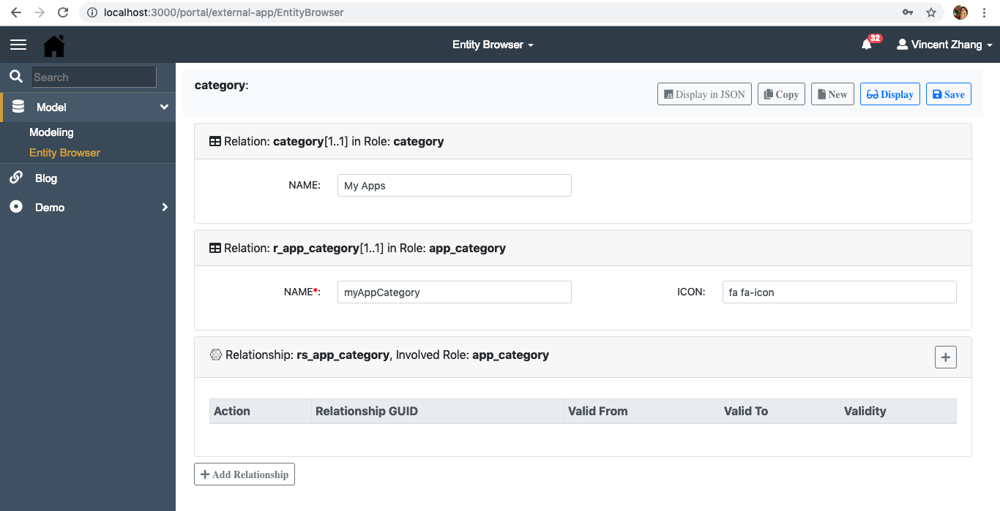
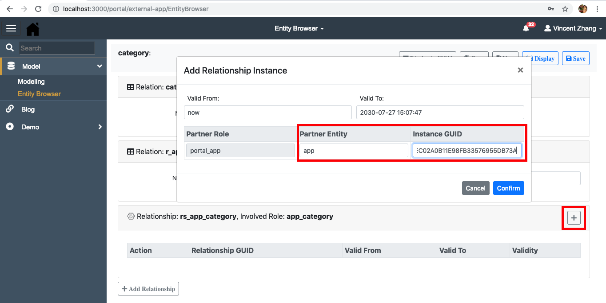

# Portal
Single App cannot always fulfill your business requirements, 
you need multiple Apps work together to form an application system and support your business processes. 
Among all the important components of an application system, a navigation portal is always the key.
Portal provides such navigation functionalities that are purely based on Angular, 
and is designed for combining different web applications to form a business application system. 

Inspired by other successful navigation systems (like Window10, OSX, Amazon's hover submenu, bootstrap, and so on), 
Portal provides following features:
1. Role-based.
2. Fuzzy search.
3. Recent access.
4. Hover submenu.
5. APP lazy loading  


You can also experience yourself in this [DEMO](http://darkhouse.com.cn/logon). 
Please logon with user **DH001** and password **Dark1234**.

## To Begin
1. Download and Run an Initial Installation:
   ```bash
   $ git clone https://github.com/VinceZK/Portal.git
   $ npm install
   ```
2. Create the database in MySQL(So far, only MySQL):
 
   Copy file "MDB.sql" in the project root to your sql console and execute.
   The script will create database "MDB" which contains all the tables and test data. 
      
   Please also create a DB user 'nodejs' with password 'nodejs'. 
   By default, Portal uses credential 'nodejs/nodejs' to connect MySql at port 3306. 
   You can of course change the default settings. Please refer <https://github.com/VinceZK/json-on-relations>
  
3. Start portal
   ```bash
   $ npm run prod
   ```
4. Logon portal:

   Access <http://localhost:3000>, and logon with user 'DH001' and password 'Dark1234'.   
  
## How to Enhance
Portal is developed using Angular and its server-side runs in NodeJS. 
You can either directly use it without any coding or enhance it according to your needs. 

The UI codes reside in folder `src/app`, which follows the Angular default project template. 
After changing, you can run `ng build` to generate the runtime stuff under folder `dist/portal`.
Remember to adjust the `dist/portal/index.html` to make the base setting to `<base href="/portal/">`.

The server-side is quite simple with the help of [json-on-relations](https://github.com/VinceZK/json-on-relations).
Besides the `server.js` in the root, there is only one js file 'identity_ctrl.js' in the folder `server`.
Usually, you don't need to change either of them. You can however add new js files under `server` folder
to encapsulate your own business logic. 

The logon page is apart from Portal. It is another reusable component [ui-logon](https://github.com/VinceZK/Logon).
You can only find the compiled runtime stuff under `dist/logon`. 
If you want to change the logon page, please refer [ui-logon](https://github.com/VinceZK/Logon).

### Change the Theme
Portal doesn't leverage any existing CSS frameworks(like Bootstrap), which conversely means you 
can use any of the existing CSS frameworks without introducing much conflicts. 

The existing CSS resides in 4 places:
+ `./styles.css`: Global styles and other styles used in dependent modules.
+ `./src/app/app.component.css`: Portal framework styles.
+ `./src/app/head-bar/head-bar.component.css`: Head bar styles.
+ `./src/app/side-menu/side-menu.component.css`: Side menu styles.

## Add Apps 
There are 2 options to add your Apps into Portal:
1. Register any kinds of web Apps to Portal;
2. Develop Apps directly into the Portal;

### Register Apps into Portal
After logon, you navigate to `Model->Entity Browser`. 
Choose `app` in the `Entity ID`, and click button `New`.


Maintain your App name and ID(unique). Since your App is not developed in Portal, 
so mark `IS_EXTERNAL` to 1(means true). In the `ROUTE_LINK`, maintain the URL of your App.
The URL supports both absolute and relative path. 
If your App is deployed in the same server with Portal, then use relative path. 
The Relationship bellow is to assign the App into an existing category.  


You can create a category to group your Apps. Choose `category` in the initial page and click `New`.


Maintain you category name and ID(unique). You can give the category an ICON which you can choose
from the site [Font Awesome](https://fontawesome.com/icons?d=gallery&m=free). 
Also add the relationship `rs_app_categoy` with involved role `app_category`.


Assign the App UUID you just created to the relationship. You need to click the `+` button to invoke the dialog.


You need also assign your category to the permission entity `administrator`. 
Please just refer the existing `Demo` category to maintain the relationships.
After that, refresh the Portal page, you will see your App in the new category.

### Develop Apps into Portal
You add your Angular components to the folder `src/app`. It is recommended to use Angular's
[Asynchronous Routing](https://angular.io/guide/router#milestone-6-asynchronous-routing).
You then need to add the module references to `./src/app/app-routing.module.ts`.

Please refer demo modules `dashboard` and `handsontable`. 
`dashboard` tests the integration with [D3](https://d3js.org/); 
while `handsontable` tests the integration with [Handsontable](https://handsontable.com/). 

It is also recommended to use [json-on-relations](https://github.com/VinceZK/json-on-relations)
to model your business entities, so that you can avoid too much server-side coding.

After that, you follow the same steps to register your App into Portal.
The only difference is to leave `IS_EXTERNAL` to empty(or 0).
 
## License
[The MIT License](http://opensource.org/licenses/MIT)
