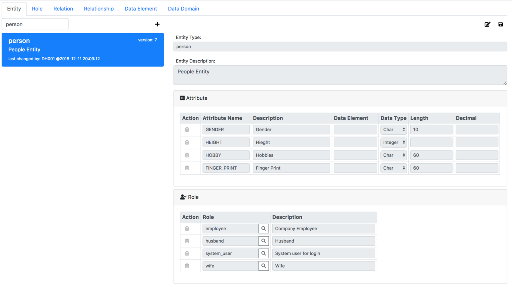
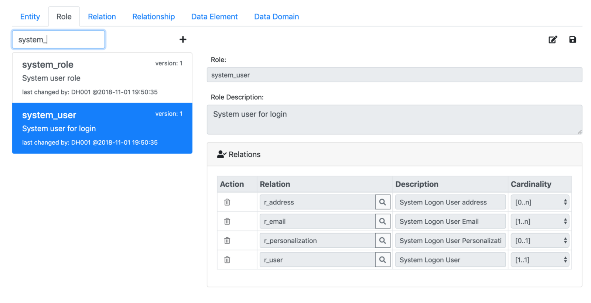
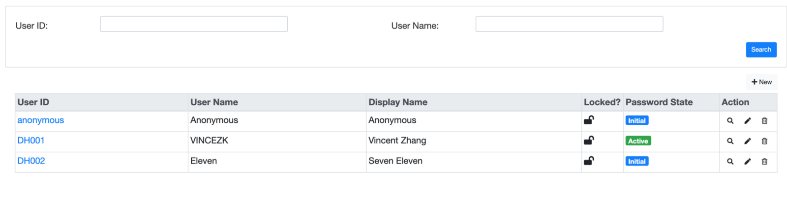
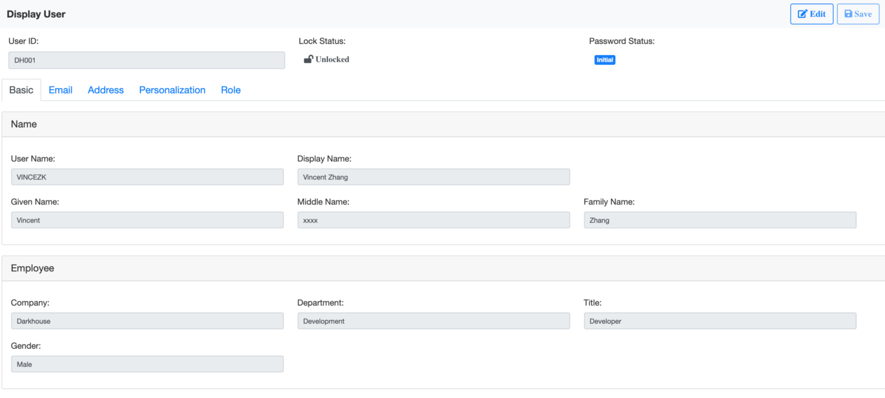
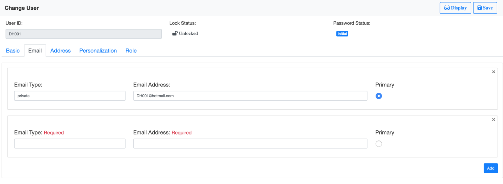
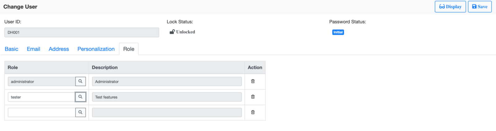
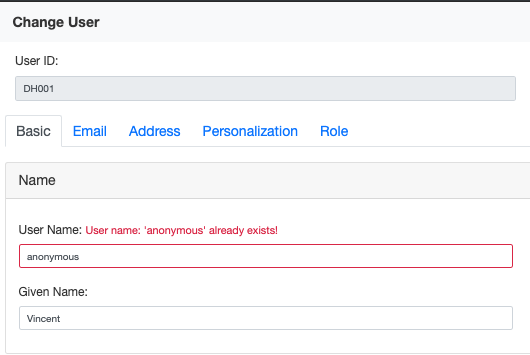
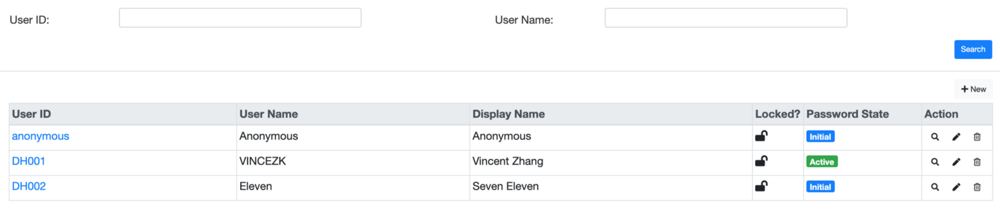
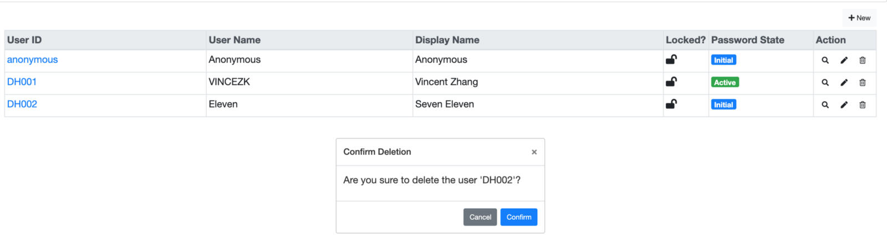

# Build a Real CRUD App using Angular
Well, there are tongs of blogs on how to build a CRUD app. But this blog is trying to focus on the word **“Real”**. 
Lots of examples show people how easy it is to build a CRUD app. 
As I never think it is that easy, so I try to tell how difficult it is? 
What are the hiding or missing pieces in those easy examples? And how we can simplified it without losing qualities.

I will use the example of user management module, which almost every system needs. 
It is a good example to dive into the nitty-gritty. 
A user is a person who has been granted permissions to access a system’s resource. 
You will read a lot of thoughts, patterns, and difficulties in developing such kind of Apps.

I use Angular as the UI technology. Because our philosophy agrees, mainly on the bidirectional binding and component structuring. 
Of course, a CRUD app involves a lot of other technologies. Some are so essential that we just forget their existences. 
Besides OS and Database, I build the app on NodeJS stack. 
You can have a first glance on the [demo](https://darkhouse.com.cn/portal/users) to see if it worth your time to continue reading. 
The complete code is hosted in [Github](https://github.com/VinceZK/Portal/tree/master/src/app/user).

## Modeling First
Now the first question, where to start? Some prefer to draw a UI mockup, 
while others prefer to design the DB tables. Whichever approach, you are actually modeling. 
You are thinking about what attributes a user should have. So, let’s try in the trendy way, using JSON for modeling.
 ```json
{"r_user": {"USER_ID": "DH001", "USER_NAME": "VINCEZK", "PASSWORD": "Dark1234", "PWD_STATE": 1, "LOCK": null,
	          "DISPLAY_NAME": "Vincent Zhang", "FAMILY_NAME": "Zhang", "GIVEN_NAME": "Vincent", "MIDDLE_NAME": null},
 "r_employee": {"USER_ID": "DH001", "COMPANY_ID": "Darkhouse", "DEPARTMENT_ID": "Development", "TITLE": "Developer", "GENDER": "Male"},
 "r_email": [
	 {"EMAIL": "xxxx@hotmail.com", "TYPE": "private", "PRIMARY": 1},
	 {"EMAIL": "xxxx@darkhouse.com", "TYPE": "work", "PRIMARY": 0}
 ],
 "r_address": [
	 {"ADDRESS_ID": 527, "COUNTRY": "China", "CITY": "Shanghai", "POSTCODE": 201202, 
	  "ADDRESS_VALUE": "Room #999, Building #99, XXX Road #999", "TYPE": "Current Live", "PRIMARY": 1 },
	 {"ADDRESS_ID": 528, "COUNTRY": "China", "CITY": "Haimen", "POSTCODE": 226126,
	  "ADDRESS_VALUE": "Village LeeZhoo", "TYPE": "Born Place", "PRIMARY": 0}
 ],
 "r_personalization": {"USER_ID": "DH001", "DATE_FORMAT": null, "DECIMAL_FORMAT": null, "TIMEZONE": "UTC+8", "LANGUAGE": "ZH" },
 "relationshipWithRole": [
	 {"NAME": "administrator"},
	 {"NAME": "tester"}
 ]
}
 ```
The main benefit of JSON modeling is handy. You only need a notepad and some protocols in mind. 
For example, “r_user” is a relation which groups some related attributes together. 
In case the relation has multiple tuples, then use array, like “r_email” and “r_address”. 
If the entity has relationships with other entities, then refer “relationshipWithRole”.  

Now, with this JSON model, we can extend up and down: the UI, and the database. 
Which one first? Well, if you have stakeholders, please do the UI first. 
In my case, since I have no such pressure, I will do the database first.

Here comes the old problem: Object Relational Mapping. The JSON model I did is object-based. 
Should I store it in the same object fashion? My answer is always “No”. 
We store data only because we will report them in future. 
And when reporting data, we are dealing with “Set” more than “Object”. 
If I invest less during data store, then I will payback when reporting on them. 
So I choose a Relational Database and I will do the object relational mapping using 
the framework [JSON-on-Relations](https://github.com/VinceZK/json-on-relations).

Since a user is a person, so I create 2 roles “system_user” and “employee”, and assign them to the person entity.
  

Within role “system_user”, I assign 4 relations: “r_address”, “r_email”, “r_personalization”, and “r_user”. 
Each relation has its cardinality setting. 
For example: “[1..1]” for “r_user” means each entity instance must have 1 item in relation “r_user”.
  

With the graphic modeling tool of [JSON-on-Relations](https://github.com/VinceZK/json-on-relations), 
I can easily create the DB tables and make them compose the “user” entity. 
As you can see, it follows Entity-Relationship Model concept, which sounds outmoded, 
but actually is more profound than ORM stuff nowadays. 
Besides, [JSON-on-Relations](https://github.com/VinceZK/json-on-relations)
 provides out-of-box RESTful APIs to allow CRUD operations on an entity.

But modeling is not an easy piece. Tools can only help you to create it in DB, but can not help you to design it. 
The tricky thing in modeling is how to achieve applicability, extensibility, and reusability. 
People are talking about “growing architecture”, which I don’t believe it works in data modeling. 
A careful design on data modeling is essential to the life of your software. 
There is just no “growing” on a poor data model.

When I design the “user” model, I first think that a user must be a person. 
However, it’s not aways the case. A communication user which is used in an A2A integration scenario is not a person. 
It is just a credential with permissions to access certain system resource. 
So I define “system_user” as a role, rather than an entity. 
When it is assigned to a person, then the person takes system user role to access the system resource. 
As you seen, modeling is actually philosopher thinking, metaphysics, especially.

## Draw UI
A CRUD App, from architecture point of view, usually has 3 layers: DB, server-side logic, and UI-side logic. 
The whole business logic is spread among them. It is hardly to eliminate anyone of them. 
The server-side logic is used to glue DB and UI. 
Without this middle layer, UI may have to load the whole data from the DB. 
Just like you open an Office document on your desktop. 
But bear in mind, **a CRUD App is used by multiple users for concurrency accessing**. 
That is the fundamental difference comparing with personal Apps. So next, I will draw the UI.

Depends on how you are familiar with the UI technologies, you can either draw the UI with a pencil and paper, 
or leverage some UI mockup tools, or directly using the formal UI development tools. 
Since I already have the UI in mind during modeling, and I can freely draw it using HTML and CSS, 
then I can save some time to convert UI mockups to the real UIs. My UI has 2 pages: Search&List page and Detail page.

  

The Search&List page allows you to do search and list of users. 
Besides, you can also create a new user, or delete an existing one. 
Clicking the user ID link, or the display/change action will navigate to the Detail page.


The Detail page shows all detail information of a user. 
It has a fix header to show the most important information, and 5 tabs to group different types of other information. 
At the top, there is a toolbar to contain the “Edit/Display” and “Save” buttons at the right side.

The 2 pages are quite static. Data is fixed in HTML, buttons are disabled, links are fake. So far, 
I only want to draw it down and to see if it fits my idea. 
In real projects, you need show them to the stakeholders to check if the requirements are met.

People may argue why you manually build the UIs? 
Aren’t there lots of tools that can generate UIs automatically from the data model? Well, 
I can only say: for all my known products and experienced projects, 
I’ve never seen a real successful one that follows the approach. 
Maybe, a lot of demos, PoCs, toys, and preachers are using such technologies, 
like either model generates UI or UI generates model.

As I said on the 3 layers, you can hardly eliminate one. This rule also applies to design time. 
Each layer has its own modeling languages to describe the same entity. 
DB uses the relational algebra to achieve full path access on physical storage; 
Server-side usually uses the Object-Oriented programming to operate the data in the memory; 
UI tries to speak human languages to be more user-friendly. With those different appealing, 
we can hardly generate one from another using some fixed rules. 
What we can do is to map and translate the 3 modeling languages. From DB to the server-side, 
we say Object-Relational mapping; and from server-side to UI, we say UI-Object mapping.

## Object to UI Mapping
Actually, I am quite enjoying drawing the UI, especially, 
if you have the right building blocks and can immediately see the changed effects. 
Here, I use [Bootstrap](https://getbootstrap.com/docs/4.3/layout/overview/) for typographic, 
and [Angular Server](https://angular.io/guide/quickstart#step-3-serve-the-application) for real-time rendering. 
When the UI looks good to you, it’s time to bind the data and logic. 
With Angular’s Reactive Form, it is quite straight forward.

No matter how the UI looks like, behind the sense, there is a coherent object. 
And what I say “object” here means a nested structure. Like a header structure with different item structures, 
and item structures of item, sort of thing. My “user” object, 
if represented in Angular’s FormGroup, looks like below:
```typescript
this.userForm = this.fb.group({
  USER_ID: ['DH001', [Validators.required]], LOCK: ['Unlocked'], PWD_STATUS: [''],
  userBasic: this.fb.group({
    names: this.fb.group({
      USER_NAME: ['VINCEZK', [Validators.required]],
      DISPLAY_NAME: ['Vincent Zhang', [Validators.required]],
      GIVEN_NAME: ['Vincent'], MIDDLE_NAME: [''], FAMILY_NAME: ['Zhang']
    }),
    employee: this.fb.group({
      TITLE: ['Developer'], DEPARTMENT_ID: ['Development'], 
      COMPANY_ID: ['Darkhouse', [Validators.required]], GENDER: ['Male']
    })
  }),
  emails:  this.fb.array([
    this.fb.group({
      EMAIL: ['DH001@hotmail.com'], TYPE: ['private'], PRIMARY: ['1']
    });
    this.fb.group({
      EMAIL: ['DH001@darkhouse.com'], TYPE: ['work'], PRIMARY: ['0']
    });
  ]),
  addresses: this.fb.array([
    this.fb.group({
      ADDRESS_ID: [''], TYPE: ['Current Live', [Validators.required]],
      ADDRESS_VALUE: ['Room #999, Building #99, XXX Road #999', [Validators.required]],
      POSTCODE: ['201202'], CITY: ['Shanghai'], COUNTRY: ['China'], PRIMARY: ['1']
    })
  ]),
  userPersonalization: this.fb.group({
    USER_ID: ['DH001'], LANGUAGE: ['ZH'], TIMEZONE: ['UTC+8'], DECIMAL_FORMAT: [''], DATE_FORMAT: ['']
  }),
  userRole: this.fb.array([
    this.fb.group({
      NAME: ['administrator'], DESCRIPTION: ['Administrator'],
      system_role_INSTANCE_GUID: ['391E75B02A1811E981F3C33C6FB0A7C1'],
      RELATIONSHIP_INSTANCE_GUID: ['06FEB4702A1B11E981F3C33C6FB0A7C1']
    })
  ])
}); 
```

Angular introduces FormGroup and its builder(this.fb) to construct an object. 
Not just the structure and the value, you can also add some validators. 
For example, I add “Validators.required” on attribute “USER_ID” to state it is not empty-allowed. 
Further more, the FormGroup object handles the bi-directional binding between the UI(HTML) and the object(JS). 
Which means any changes from the UI will be synchronized immediately to the object, and vice-vera.
```html
<div class="col-lg-4 form-group" [formGroup]="userForm">
  <label for="user_id" class="col-form-label dk-form-label">User ID:</label>
  <input id="user_id" name="user_id" formControlName="USER_ID" type="text" class="form-control">
</div>
<div class="col-lg-4 form-group" [formGroup]="userForm">
  <label for="lockStatus" class="col-form-label">Lock Status:</label>
  <div id="lockStatus" class="form-control">
    <span *ngIf="userForm.get('LOCK').value" class="fas fa-lock" > Locked</span>
    <span *ngIf="!userForm.get('LOCK').value" class="fas fa-lock-open"> Unlocked</span>
  </div>
</div>
<div class="col-lg-4 form-group" [formGroup]="userForm">
  <label for="passwordStatus" class="col-form-label">Password Status:</label>
  <div id="passwordStatus" class="form-control" [ngSwitch]="userForm.get('PWD_STATUS').value">
    <div *ngSwitchCase="">
      <span class="badge badge-primary">Initial</span>
    </div>
    <div *ngSwitchCase="1">
      <span class="badge badge-success">Active</span>
    </div>
    <div *ngSwitchCase="2">
      <span class="badge badge-warning">Renew</span>
    </div>
  </div>
</div>
```

From above excerpt, you can find how the FormGroup object is binding to the HTML through the attributes “[formGroup]” and “formControlName”. 
Sometimes, it is not always to show the value directly, but with some conversions. Like “lockStatus” and “passwordStatus”, 
I want to show them in a more initiative way by giving them human readable descriptions and icons.

I have some attributes grouped in multiple tuples, like “emails”, “addresses”, and “userRole”. 
They can be constructed in Angular FormArray. But in UI, they can be represented in various ways. 
You can choose LIST or TABLE controls, each again has a lot of choices in detail. 
Based on the nature of the data object, and also considering the “Add” & “Remove” operations, 
you may find it is sometimes a hard decision.


I choose LIST for “emails” and “addresses”. Mainly because a user may not have so many emails or addresses. 
Thus, it is more natural to represent them in a form-like way. So when you click the “Add” button, 
a new empty form is appended to allow to type a new email address. 
Click “X” in the up-right corner will remove an email.


With “userRole”, I use TABLE. Not just because a user may have many roles assigned, 
but more because it is an assignment maintenance. That is, “user” and “role” are 2 different entities. 
Here, we only maintain the relationships between them. Thus the information can be shown in a dense way.

Notice, I only have the “remove” button in the “Action” column. There is no “add” button. 
When you are typing a role name in the last row, it will automatically append an empty row. 
This design makes the UI much clean and natural. 
However, it assumes that the role assignment is only one field input and always one by one. 
Don’t use this pattern in any other cases.

Now it seems my UI is much more dynamic. 
At least, the data is feed from an object under the hood, rather than hard-coded in HTML. 
However, both the FormGroup object and the HTML live in the Browser. 
So we are still on the UI layer, and we still haven’t connected with the server-side. 
But you may find that the structure of the FormGroup object and the JSON data model looks similar. 
This is because the 2 are both object model. If I can recall you, we first design the JSON data model, 
then we draw the UI mockup, during when we form the FormGroup object. 
As long as the concept is consistent, we can easily map and connect objects from different layers.

Thanks to JSON-On-Relations, I don’t need to write any server-side code to get the JSON object. 
I just simply write a service call in the client-side.
```typescript
getUserDetail(userID: string): Observable<Entity | Message[]> {
  const pieceObject = {
    ID: { RELATION_ID: 'r_user', USER_ID: userID},
    piece: {RELATIONS: ['r_user', 'r_employee', 'r_email', 'r_address', 'r_personalization'],
            RELATIONSHIPS: [
              {
                RELATIONSHIP_ID: 'rs_user_role',
                PARTNER_ENTITY_PIECES: { RELATIONS: ['r_role'] }
              }]
    }
  };
  return this.http.post<Entity | Message[]>(
    this.originalHost + `/api/entity/instance/piece`, pieceObject, httpOptions).pipe(
    catchError(this.handleError<any>('getUserDetail')));
}
```
Above service call gets user detail JSON object by user ID. 
It composes a request to ask for certain pieces of the entity information. 
If you check the grammar of “pieceObject”, 
it is not difficult to understand that it asks for the data from relations 
“r_user”, “r_employee”, “r_email”, “r_address”, “r_personalization”, 
as well as the relationship “rs_user_role”. 
The service call returns the JSON response with the same schema like the JSON model at the begining.

The next thing is to map the returned JSON object(data) to the FromGroup object(userForm). 
Which is quite straight forward. Only to be noticed is the array objects like “email”, “address”, 
and “role”, I use dedicate loops to push the single FormGroup to the FormArray.
```typescript
this.userForm = this.fb.group({
  USER_ID: [data['r_user'][0]['USER_ID'], [Validators.required]],
  LOCK: [data['r_user'][0]['LOCK']],
  PWD_STATUS: [data['r_user'][0]['PWD_STATUS']],
  userBasic: this.fb.group({
    names: this.fb.group({
      USER_NAME: [data['r_user'][0]['USER_NAME'], [Validators.required]],
      DISPLAY_NAME: [data['r_user'][0]['DISPLAY_NAME'], [Validators.required]],
      GIVEN_NAME: [data['r_user'][0]['GIVEN_NAME']],
      MIDDLE_NAME: [data['r_user'][0]['MIDDLE_NAME']],
      FAMILY_NAME: [data['r_user'][0]['FAMILY_NAME']]
    }),
    employee: this.fb.group({
      TITLE: [data['r_employee'][0]['TITLE']],
      DEPARTMENT_ID: [data['r_employee'][0]['DEPARTMENT_ID']],
      COMPANY_ID: [data['r_employee'][0]['COMPANY_ID'], [Validators.required]],
      GENDER: [data['r_employee'][0]['GENDER']]
    })
  }),
  emails:  this.fb.array([]),
  addresses: this.fb.array([]),
  userPersonalization: this.fb.group({
    USER_ID: [data['r_personalization'] ? data['r_personalization'][0]['USER_ID'] : ''],
    LANGUAGE: [data['r_personalization'] ? data['r_personalization'][0]['LANGUAGE'] : ''],
    TIMEZONE: [data['r_personalization'] ? data['r_personalization'][0]['TIMEZONE'] : ''],
    DECIMAL_FORMAT: [data['r_personalization'] ? data['r_personalization'][0]['DECIMAL_FORMAT'] : ''],
    DATE_FORMAT: [data['r_personalization'] ? data['r_personalization'][0]['DATE_FORMAT'] : '']
  }),
  userRole: this.fb.array([])
});

const emailArray = this.userForm.get('emails') as FormArray;
data['r_email'].forEach( email => {
  emailArray.push(
    this.fb.group({
      EMAIL: [email['EMAIL'], [Validators.required]],
      TYPE: [email['TYPE'], [Validators.required]],
      PRIMARY: [email['PRIMARY']]
    })
  );
});

const addressArray = this.userForm.get('addresses') as FormArray;
if (data['r_address']) {
  data['r_address'].forEach( address => {
    addressArray.push(
      this.fb.group({
        ADDRESS_ID: [address['ADDRESS_ID']],
        TYPE: [address['TYPE'], [Validators.required]],
        ADDRESS_VALUE: [address['ADDRESS_VALUE'], [Validators.required]],
        POSTCODE: [address['POSTCODE']],
        CITY: [address['CITY']],
        COUNTRY: [address['COUNTRY']],
        PRIMARY: [address['PRIMARY']]
      })
    );
  });
}

const roleArray = this.userForm.get('userRole') as FormArray;
const userRoleRelationship = data['relationships'][0];
if (userRoleRelationship) {
  userRoleRelationship.values.forEach( value => {
    const roleInstance = value.PARTNER_INSTANCES[0];
    roleArray.push(
      this.fb.group({
        NAME: [roleInstance['r_role'][0]['NAME']],
        DESCRIPTION: [roleInstance['r_role'][0]['DESCRIPTION']],
        system_role_INSTANCE_GUID: [roleInstance['INSTANCE_GUID']],
        RELATIONSHIP_INSTANCE_GUID: [value['RELATIONSHIP_INSTANCE_GUID']]
      })
    );
  });
}  
```

Until now, I just finished one complete data flow from DB to UI. 
That is the letter “R” in the CRUD abbreviation, which is reading a user object. 
The flow can be described as below:

***DB(relations) →JSON-On-Relations(server-side JS)→FormGroup(client-side JS) →UI(HTML).***

Thanks to JSON-On-Relations, I saved a lot of efforts on the DB and server layer. 
Instead, I focused much on modeling and UI. The next step I will do the letter “U”, which is updating a user object.

## UI to Object Mapping
So it is the opposite direction:

***UI(HTML) →FormGroup(client-side JS) →JSON-On-Relations(server-side JS) →DB(relations).***

We know in mathematics, usually calculation from one direction is easy, but the opposite direction is extremely hard. 
So do the “Read” and “Update”. Compare to “Read”, “Update” needs more attentions, 
which includes data validation, error handling, concurrency control, and work protection.

But before touching the updating flow, one thing must be done first is the switch between edit mode and display mode. 
If you think it is a piece of cake, well, I would argue a lot. 
Usually, in those CRUD demos you won’t see the edit/display switch. 
This is because those demos will never be used in productive. 
As I said, a CRUD App is used by multiple concurrency users. 
Differentiating the edit and display mode helps to understand 
whether the object is protected for changing either by permission or by concurrency control.

Some Apps even use different UI controls or design for their edit and display mode. 
This is usually to achieve better user experience in displaying, and/or simplify the editing. 
I will just reuse the same page of the display mode. 
Therefore, I have to add the “readonly” attribute to all the editable UI controls, and bind it to a variable. 
The tricky thing is for controls like checkbox and radio-box, they just don’t have the “readonly” attribute. 
Thus, I have to code special logic to them. Depends on the complexity of your UI, 
the efforts may vary in implementing the 2 UI states. 
For example, I also have special logic on the LIST and TABLE controls by 
either removing the invalid lines or adding the empty lines.

Usually, the switch to edit mode and the switch to display mode are implemented differently. 
Following logic is applied for the switch to edit mode:

1. Check if the user has the permission to change the object;
2. Check if there is a concurrency user editing the same object;
3. Change the UI to editable state.

Following logic is applied for the switch to display mode:

1. Check if the object is changed, if yes, ask for whether saving or ignoring the changes ;
2. Release the lock on the object;
3. Change the UI to readonly state.

Once I am comfortable with the switching, I know the next big thing is validation. 
Because I know validation is endless. 
One can easily think about dozens of validation rules on the single fields and combinations of fields. 
It is all about how much would you like to invest on validation. 
Nevertheless, I can simply conclude that most validations are about data domains, 
and they can be implemented either in client-side or in server-side.

Client-side validations are cheaper. Use the client-side validations whenever possible. 
Angular provides some out-of-box validation functions, like: required, maxLength, minLength, email, and so on. 
However, client-side validations can only cover a little. 
Because most of the data context lies in the server-side. Thus, server-side validation is unavoidable.

My first validation is on the field “User Name”. 
Because it is a unique attribute, I have to make sure the user’s input is unique system wide. 
The main considering is when to trigger the validation? Right after the value is inputted, 
or together with the saving request? The answer is aways the earlier the better. 
So I implemented an asynchronous validation function and assign it to the “USER_NAME” FormControl.
```typescript
const userNameCtrl = this.userForm.get('userBasic.names.USER_NAME') as FormControl;
userNameCtrl.setAsyncValidators(
      existingUserNameValidator(this.identityService, this.messageService, this.userForm.get('USER_ID').value));
...


export function existingUserNameValidator(identityService: IdentityService,
                                          messageService: MessageService,
                                          userID: string): AsyncValidatorFn {
  return (control: AbstractControl): Promise<ValidationErrors | null> | Observable<ValidationErrors | null> => {
    return timer(500).pipe(
      switchMap( () => identityService.getUserByUserName(control.value).pipe(
        map(data => {
          if (data['r_user'] && data['r_user'][0]['USER_ID'] !== userID) {
            return {message: messageService.generateMessage('USER', 'USER_NAME_EXISTS', 'E', control.value).msgShortText};
          } else {
            return null;
          }
        })
      )));
  };
}
```
The effect looks good, after the user typing some letters in the “User Name” field, 
it immediately check with the server to see if the inputted value exists or not. 
You can find I set the “timer(500)” in the validation function, 
which means it waits for half second(500ms) when I stop typing. 
As a user, he can get the error feedback earlier without additional actions.

The user is happy now, the only problem is the cost. To implement such kind of validations, 
one needs a dedicate service. Fortunately, in my example, 
I can directly leverage JSON-On-Relations without any server-side coding. 
But I can also anticipate a lot of cases that special server-side coding is unavoidable. 
And such kinds of services may be only dedicate to the UI.

Question 1: should all the validations dedicate to the UI(include client-side validations) 
be double implemented in the server side? I think the answer is possibly yes. 
Because those validations try to be user-friendly. They are only responsible for the UI, 
and cannot guarantee the data is input from other channels(for example, API). 
The same validations should be anyway implemented again in the server side.

Question 2: should the server-side validations be embedded in the data model as much as possible? 
My answer is not really, and I know this time the answer may be controversy. 
We all know DB provides data consistency functions like unique key checks and foreign key checks. 
Why not leverage these features? My experience tells me that most of data models are not perfect when born. 
They require to be adjusted along the lifetime. The more logic you put in the data model, 
the higher cost you will face in adjusting them. 
Just think about the data conversion if you adjust the key fields. 
However, if you split the logic apart from the data model, you gain much more flexibility in adjusting them. 
That is not to say you should always avoid using them, but just suggest thinking twice.

Accompanied with validation is the error handling. How you report the validation errors to the user gracefully? 
For field value validation, it is natural to display the error tips next to it. 
And of course the error should be highlighted. This needs some HTML and CSS work. 
If the error display is made to the UI control, then it will be very helpful and save efforts.


Besides displaying the validation errors next to the fields, 
there are also object level messages which need to shown properly. 
And it is not only boundary to error messages, but also warning, information, 
and successful messages. And messages could be both short texts and long texts, 
they need to support multi-languages. Messages should be maintained in both client-side and server-side. 
And finally you find you need a message framework to cover all those requirements. 
This is why I created the [UI-Message](https://github.com/VinceZK/ui-message).

With all the validations passed, the data can be saved to the DB now. 
I need to call the change entity RESTful API of JSON-On-Relations. 
The API asks for a JSON object similar to our modeling object, 
but with each relation tuple a reserved “action” attribute to indicate what is the action made to the tuple. 
Its value could be one of “add”, “delete”, or “update”. With the “action” attribute, 
One can tell JSON-On-Relations what changes have been made to an object.

It’s just amazing that Angular FormGroup knows which FormControls are changed through the “dirty” attribute. 
Thus we can compose what has been changed to the object from the changed FormGroup object. 
Coding such kind of mapping from the UI object to the server side object and tells the DB 
what are the changes is usually boring and error prone. This is why existing ORM solutions have their room to survive. 
But what I don’t like is they also introduce a lot of unnecessary complexities. 
In fact, we only need some utility methods to help to do the mapping.
```typescript
_composeChangesToUser() {
  this.changedUser['ENTITY_ID'] = 'person';
  this.changedUser['INSTANCE_GUID'] = this.instanceGUID;

  const userBasicFormGroup = this.userForm.get('userBasic');
  const userID = this.userForm.get('USER_ID').value;
  if (userBasicFormGroup.dirty) {
    const userBasicNamesFormGroup = userBasicFormGroup.get('names') as FormGroup;
    this.changedUser['r_user'] = this.uiMapperService.composeChangedRelation(
      userBasicNamesFormGroup, {USER_ID: userID}, this.isNewMode);

    const userBasicEmployeeFormGroup = userBasicFormGroup.get('employee') as FormGroup;
    this.changedUser['r_employee'] = this.uiMapperService.composeChangedRelation(
      userBasicEmployeeFormGroup, {USER_ID: userID}, this.isNewMode);
  }

  const userEmailFormArray = this.userForm.get('emails') as FormArray;
  this.changedUser['r_email'] = this.uiMapperService.composeChangedRelationArray(
    userEmailFormArray, this.originalUserValue['emails'], {EMAIL: null});

  const userAddressFormArray = this.userForm.get('addresses') as FormArray;
  this.changedUser['r_address'] = this.uiMapperService.composeChangedRelationArray(
    userAddressFormArray, this.originalUserValue['addresses'], {ADDRESS_ID: null});

  const userPersonalizationFormGroup = this.userForm.get('userPersonalization') as FormGroup;
  this.changedUser['r_personalization'] = this.uiMapperService.composeChangedRelation(
    userPersonalizationFormGroup, {USER_ID: userID}, !userPersonalizationFormGroup.get('USER_ID').value);

  const userRoleFormArray = this.userForm.get('userRole') as FormArray;
  const relationship = this.uiMapperService.composeChangedRelationship(
    'rs_user_role',
    [{ENTITY_ID: 'permission', ROLE_ID: 'system_role'}],
    userRoleFormArray, this.originalUserValue['userRole'], ['NAME', 'DESCRIPTION']);
  if (relationship) {this.changedUser['relationships'] = [relationship]; }
}
```
Using the “UiMapperService” provided by JSON-On-Relations, I can easily compose the changes from the FormGroup object. 
The “UiMapperService” has 3 methods:
1. **composeChangedRelation**: converts a FormGroup to a changed relation format.
2. **composeChangedRelationArray**: converts a FormArray to a changed relation array format.
3. **composeChangedRelationship**: converts a FormArray to a changed relationship assignment format.

Some take an easier way: completely delete the original one, and then insert a new one. 
In this way, developers don’t bother to track the changes. This may work for very simple entities. 
Despite less elegance, in most cases, it produces a lot of side effects. 
For example, an entity may have a lot of relationships with others, 
operating the entity as a whole rises the concurrency conflicts.

The final shot is easy, just call the RESTful API, let JSON-On-Relations help you to forward the changes to DB. 
It returns either the successfully saved object or error messages. 
In below excerpt, the “saveUser” method differentiate “update” and “new” mode 
by checking whether the user object has “INSTANCE_GUID”. If it has, then use “put”, otherwise, use “post”.
```typescript
saveUser(user: Entity): Observable<Entity | Message[]> {
  if (user['INSTANCE_GUID']) {
    return this.http.put<Entity | Message[]>(
      this.originalHost + `/api/entity`, user, httpOptions).pipe(
      catchError(this.handleError<any>('saveUser')));
  } else {
    return this.http.post<Entity | Message[]>(
      this.originalHost + `/api/entity`, user, httpOptions).pipe(
      catchError(this.handleError<any>('saveUser')));
  }
}
```

It seems I have conquered the most difficult path, the letter “U” in CRUD. 
Maybe there is still one thing left, the work protection. 
Imagine, when you changed something on an object, then you accidentally click the “Back” button of your Browser, 
what are you expecting? You hope the App block the navigation by popping up a dialog 
to ask confirmation of leaving current page. This makes me to jump to the next issue: navigation.

## Navigation
Navigation is a difficult topic. Fortunately, [Angular](https://angular.io/guide/router) helps a lot. 
In my case, there are only 2 pages. Even though, I still spent some mind.

Before start thinking navigation, I need build the search&list page. 
It is much easier than the detail page, since there is no “U” letter. 
And more fortunately, I still don’t need any server-side coding, as JSON-On-Relations already provides me 
a [generic query API](https://github.com/VinceZK/json-on-relations#generic-query-request).
```typescript
searchUsers(userID: string, userName: string): Observable<UserList[] | Message[]> {
  const queryObject = new QueryObject();
  queryObject.ENTITY_ID = 'person';
  queryObject.RELATION_ID = 'r_user';
  queryObject.PROJECTION = ['USER_ID', 'USER_NAME', 'DISPLAY_NAME', 'LOCK', 'PWD_STATE'];
  queryObject.FILTER = [];
  if (userID) {
    if (userID.includes('*')) {
      userID = userID.replace(/\*/gi, '%');
      queryObject.FILTER.push({FIELD_NAME: 'USER_ID', OPERATOR: 'CN', LOW: userID});
    } else {
      queryObject.FILTER.push({FIELD_NAME: 'USER_ID', OPERATOR: 'EQ', LOW: userID});
    }
  }
  if (userName) {
    if (userName.includes('*')) {
      userName = userName.replace(/\*/gi, '%');
      queryObject.FILTER.push({FIELD_NAME: 'USER_NAME', OPERATOR: 'CN', LOW: userName});
    } else {
      queryObject.FILTER.push({FIELD_NAME: 'USER_NAME', OPERATOR: 'EQ', LOW: userName});
    }
  }
  queryObject.SORT = ['USER_ID'];
  return this.http.post<any>(this.originalHost + `/api/query`, queryObject, httpOptions).pipe(
    catchError(this.handleError<any>('searchObjects')));
}
```
I just need to compose the “queryObject”, which requires a target entity, 
a leading relation, projected fields, filters, and sorts. 
Since I only allow filters on the 2 fields: “USER_ID” and “USER_NAME”, 
I coded some special logic to them. 
If user want to make wildcard “*” search, then I replace the “*” to “%”, 
since my DB only recognizes “%” as the wildcard.


The Search&List page has 3 navigations:
1. Click “User ID” and “Display” action will navigate to the detail page in display mode;
2. Click “Change” action will navigate to the detail page in edit mode;
3. Click “New” button will navigate to the detail page in new mode.

In web Apps, navigation is driven by URL. I actually took some time in designing my URLs. 
I have “/users” routed to the Search&List page, and “/users/:userID” routed to the Detail page 
with an additional parameter “action” to state the mode. 
For example, “/users/DH001;action=change” will navigate to the user “DH001” in edit mode. 
With that, in Angular, I described my routes like below:
```typescript
const routes: Routes = [
  { path: 'users', component: UserListComponent},
  { path: 'users/:userID', component: UserDetailComponent, canDeactivate: [WorkProtectionGuard]},
  { path: 'errors', component: ErrorPageComponent },
  { path: 'pageNotFound', component: NotFoundComponent },
  { path: '**', component: NotFoundComponent }
];
```
Besides the first 2 paths, I have additional 2 paths for error display and page not found. 
The last path “**” also routes to “pageNotFound” in case invalid path is input in Browser’s address bar.

The second path has an additional attribute “canDeactivate”, to which I assign my work protection logic. 
When navigation aways from the Detail page, I check if the object is dirty, then pop up confirmation dialog: 
“Discard Changes?”.

There is still one problem left. When navigating back from the Detail page to the Search&List page. 
By default, Angular triggers a reload, which is not good in my case. 
To avoid this, I implemented my own RouteReuseStrategy.
```typescript
// In app.module.ts
providers: [
  {provide: RouteReuseStrategy, useClass: CustomReuseStrategy}
]

// In custom.reuse.strategy.ts
import {ActivatedRouteSnapshot, DetachedRouteHandle, RouteReuseStrategy} from '@angular/router';

export class CustomReuseStrategy implements RouteReuseStrategy {
  routesToCache: string[] = ['users'];
  storedRouteHandles = new Map<string, DetachedRouteHandle>();

  shouldDetach(route: ActivatedRouteSnapshot): boolean {
    return this.routesToCache.indexOf(route.routeConfig.path) > -1;
  }

  store(route: ActivatedRouteSnapshot, handle: DetachedRouteHandle): void {
    this.storedRouteHandles.set(route.routeConfig.path, handle);
  }

  shouldAttach(route: ActivatedRouteSnapshot): boolean {
    return this.storedRouteHandles.has(route.routeConfig.path);
  }

  retrieve(route: ActivatedRouteSnapshot): DetachedRouteHandle {
    return this.storedRouteHandles.get(route.routeConfig.path);
  }

  shouldReuseRoute(future: ActivatedRouteSnapshot, curr: ActivatedRouteSnapshot): boolean {
    return future.routeConfig === curr.routeConfig;
  }
}
```
The main idea of the custom route strategy is to cache the Search&List page (/users). 
However, behind the problem, the more generic question is whether a page should be reloaded 
or not when navigating back to it? Well, it depends your requirements. 
And such answer is also one reason makes navigation so difficult.

In my case, for example, if I want changes(display name changed) from the Detail page also affect the Search&List page, 
then I should reload the page when navigating back. In this attempt, 
what I should do is not simply cache the whole page, but only to cache the search criteria, 
and make an auto re-search when come back. Then, think about even more complex scenarios, 
not only the search criteria, but also the column width, positions, and such sort of things. 
It will just make you mad if there is no support from the framework.

It is the time to cope with the last 2 letters “C” and “D”. 
I just leverage navigation feature to realize the creation of a new user. 
So when click the button “New”, it navigates to the path “/users/;action=new”. 
In the Detail page, I check the value of parameter “action”, if it is “new”, then I create an empty user object. 
In this way, I can reuse the logic of edit mode.
```typescript
ngOnInit() {
  this.route.paramMap.pipe(
    switchMap((params: ParamMap) => {
      this.action = params.get('action');
      if (this.action === 'new') {
        this.isNewMode = true;
        return this._createNewUser();
      } else {
        this.isNewMode = false;
        return this.identityService.getUserDetail(params.get('userID'));
      }
    })
  ).subscribe( data => {
    if ('ENTITY_ID' in data) {
      this.instanceGUID = data['INSTANCE_GUID'];
      this._generateUserForm(<Entity>data);
      if (this.isNewMode || this.action === 'change') {
        this._switch2EditMode();
      } else {
        this._switch2DisplayMode();
      }
    } else {
      const errorMessages = <Message[]>data;
      errorMessages.forEach( msg => this.messageService.add(msg));
    }
  });
}

...

_createNewUser(): Observable<Entity> {
  const userDetail = new Entity();
  userDetail['ENTITY_ID'] = 'person';
  userDetail['r_user'] = [
    { USER_ID: '', LOCK: 0, PWD_STATUS: '', USER_NAME: '', DISPLAY_NAME: '',
      GIVEN_NAME: '', MIDDLE_NAME: '', FAMILY_NAME: ''}
  ];
  userDetail['r_employee'] = [
    {TITLE: '', DEPARTMENT_ID: '', COMPANY_ID: '', GENDER: ''}
  ];
  userDetail['r_email'] = [];
  userDetail['r_personalization'] = [
    {USER_ID: '', LANGUAGE: '', TIMEZONE: '', DECIMAL_FORMAT: '', DATE_FORMAT: ''}
  ];
  userDetail['relationships'] = [];
  return of(userDetail);
}
```

For deleting a user, I need to implement a confirmation dialog on the Search&List page 
when user clicks the trash icon in the “Actions” column. 
Thanks again to JSON-On-Relations, I don’t need to code any server-side logic.


Up to now, it seems the CRUD is completed. But am I confident with my tiny App? The answer is “No”. 
Because I haven’t tested it carefully yet. Although during development, I had some fragmental tests,
 but I know it is far more enough. Just think about the number of buttons, fields, navigation routes, 
 and the combination of them in different orders. You just cannot anticipate how others will use your App. 
 So I must do the tests carefully and efficiently.

## Testing
The importance of testing is self-evident. However, how the testing is done is a controversy topic. 
Nevertheless, I follow my heart and do the tests in my own way. The only thing important is to improve my confidence.

Recall the whole process, I haven’t written anything in the server-side, 
it seems I only need to pay attention on the UI layer. 
By reading the [Angular’s testing manual](https://angular.io/guide/testing#testing), 
I played around its testing tools.

First, I don’t think I should write any [Service tests](https://angular.io/guide/testing#service-tests). 
All my services are quite simple. 
It is not worth to invest any more time after their first successful call.

Then, I wrote some [Component Class tests](https://angular.io/guide/testing#component-class-testing), 
and found it just cannot help to gain any confidence. 
Although most of my codes reside in the component class, 
but I don’t see any necessity to write additional codes to test those data mapping and conversion logic. 
I mean look at those simple “if else” and “loop” statements, are you really need them run to know whether 
they are doing wrong or right? What I really care is whether the UI behaves correctly together 
with the logic in the component Class.

I also checked [Component DOM testing](https://angular.io/guide/testing#component-dom-testing). 
At a first glance, it seems I should invest it. 
However, after some testing, I found it is not worth to continue. 
It is just not easy to use and the learning curve is steep. 
You need deep knowledge of Angular architecture so that you know how to correctly mock the runtime context. 
I just don’t want to waste time on mocking some very technique stuff, like the HTTP service. 
Also in my case, I don’t have very complex interactions with DOM, like animations. 
And my component doesn’t require any reusability.

Finally, I found the best test tool fits my case is the end-to-end(E2E) testing. 
Although the Angular team seems more recommending the Component DOM testing, 
I am quite happy with the E2E testing framework based on [Protractor](https://www.protractortest.org/#/).

I placed 2 files in the “e2e” folder: the page object: “user.po.ts” and the e2e scripts: “user.e2e-spec.ts”.

In “user.po.ts”, I mocked the actions made in the page, 
like navigating, clicking a button, input values, and get the result.
```typescript
  navigateToSearch() {
    return browser.get('/users');
  }
  
  fillUserID(userID: string = 'anonymous') {
    element(by.css('[name="user_id"]')).sendKeys(userID);
  }
  
  clickSearchButton() {
    element(by.id('search')).click();
  }
  
  getSearchResultList() {
    return element.all(by.tagName('tr'));
  }
```

In “user.e2e-spec.ts”, I orchestrated the page actions to form e2e scenarios.

```typescript
describe('Search&List Page', () => {
    beforeAll(() => {
      page.navigateToSearch();
    });

    it('should list all users when clicking button Search', () => {
      page.clickSearchButton();
      page.getSearchResultList()
        .then((list) => expect(list.length).toBeGreaterThan(2));
    });

    it('should list a user filtered by userID', () => {
      page.fillUserID(); // anonymous
      page.clickSearchButton();
      expect(page.getFirstHitUserID()).toEqual('anonymous');
    });
 }
```
Unlike what I heard from others who told that e2e testing is difficult and expensive, 
I got the opposite feelings. As you may find it is actually intuitive and easy maintain. 
Some may be worry about the brittle of e2e scripts. But in my case, it is actually quite strong. 
I use the scripts during my development and seldom do I need to adjust them. I think there could be following reasons:

1. I use “by.id” to locate the HTML elements.
2. The separation of the page object and e2e spec contributes;
3. I have a stable model and backend service.

Based on what you are developing, test methodologies and tools should be carefully chosen. 
For CRUD Apps, I believe E2E testing is the best fit. It is unlike building a framework, 
a library, or an algorithm, the main value you added are the mappings and the UI skins.

I am not a paranoid to achieve high coverage, so I still do a lot of manual tests. 
The e2e scripts really save my time when, for example, 
I want to do a small validation test on deleting a role from an existing user. 
Then I just use the scripts to help to create a user, then do the manual tests. 
I don’t need to automate these small manual tests as I am confident they should be once OK always OK.

Again, the most important thing is my confidence.

## Epilogue
In this long blog, I recall the process of developing a typical CRUD App. 
As I said, it is not an easy process. Although I leveraged a lot of frameworks, 
it still requires quite a lot of efforts if you don’t want to cut corners. 
Every time, when I develop a new CRUD App(even in the same stack), I always get different thoughts.

In earlier days, UI is rendered in server-side, so does the objects. 
We thus need a strong session management framework to hold these hot objects. 
Now, with the modern web technologies, the objects live in the client-side. 
However, the thing never changed is the mappings between relational sets and singleton objects.

Although in this blog, I leveraged JSON-On-Relations for the object relational mapping, 
I can also imagine there will be cases that its provided RESTful APIs cannot fulfill, 
for example, permission checks. Thus, it is almost unavoidable to write server-side logic. 
Mainly because **an object is not isolated in a system**. 
It must have relationships with others to make the system organic.

My tiny App is still far from complete. If I want it to be an enterprise quality CRUD App, it still needs:
1. Value helps whenever possible. For example, the field “Company” should better be a dropdown box. Then the field “Department” should be also a dropdown box with values depends on the selected company. The field “Role” should popup a search help box to allow user search and choose.
2. Permission checks. The CRUD operations on the “user” object should be securely differentiated to different users.
3. Concurrency locks. When a user is editing an object, then another user who is attempting to edit the same object should be blocked, and only displaying is allowed. Another approach is to use optimistic lock with ETAG.
4. Multi-language support. Labels, titles, and button texts should be translated into different languages. And display them in the logon languages.

Just name a few, maybe still a lot of others not mentioned, like the responsive web design. 
Nevertheless, I think good frameworks do help a lot. Like what I used in this example: 
Angular, Bootstrap, JSON-On-Relations, and UI-Message. 
They are all open sources, and are easy to obtain and learn by personal.

The other thing that can help is the pattern. For mature proprietary platforms, 
besides the frameworks, services, and libraries, it also provides a lot of patterns or examples for reference. 
With those patterns, you can build CRUD Apps more efficiently, with no corner cuttings. 
So I believe when I build the second CRUD App on the same stack, it will be much faster.

This is also the purpose of this blog. I hope it can also give you a pattern reference, 
as well as some standards and costs in building such kind of **Real** CRUD Apps.
